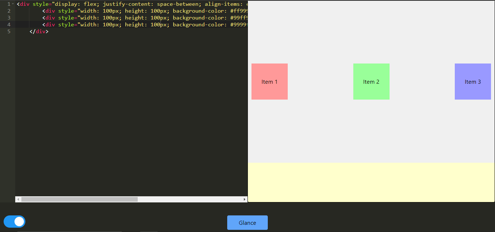
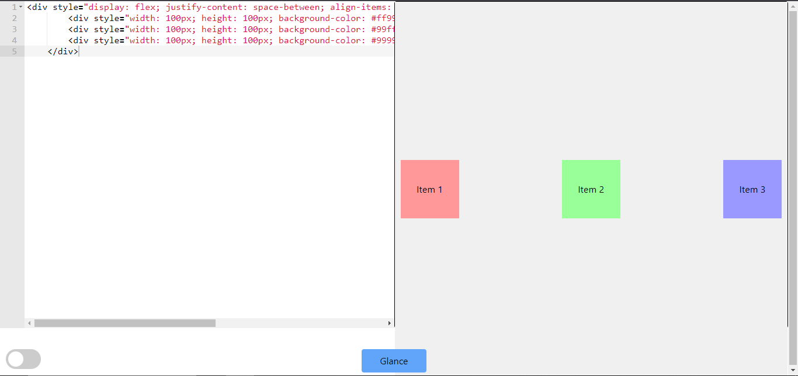

# HTML Online Editor

## Overview

The **HTML Online Editor** is a web-based tool that allows users to write HTML and CSS code and instantly see the output in a preview window. The editor is built using React, Tailwind CSS, and react-ace, and it features a user-friendly interface with dark and light themes. The project is powered by Vite for fast development and build processes.


<br>
<br>


## Features

- **Live HTML and CSS Editing**: Write and edit HTML and CSS code in real-time.
- **Preview Window**: See the output of your HTML components instantly.
- **Theme Selection**: Toggle between dark and light themes.
- **Styling with CSS**: Add styles directly using the `<style>` tag.

## Limitations

- **No JavaScript Support**: JavaScript cannot be executed or included in the editor.
- **No Import/Export Functionality**: You cannot import external files or export your code.
- **Fixed Layout**: The width of the editor and output windows is fixed and cannot be adjusted.

## Installation and Setup

To get started with the project, follow these steps:

1. **Clone the Repository**:

    ```bash
    git clone https://github.com/YashodharChavan/online-html-editor.git
    
    ```

2. **Navigate to the Project Directory**:

    ```bash
    cd html-online-editor
    ```

3. **Install Dependencies**:

    Make sure you have Node.js and npm installed. Then, install the project dependencies:

    ```bash
    npm install
    npm install -D tailwindcss
    npx tailwindcss init
    ```
4. **Configure your template paths**:
    ```bash 
    /** @type {import('tailwindcss').Config} */
module.exports = {
  content: [
    "./src/**/*.{js,jsx,ts,tsx}",
  ],
  theme: {
    extend: {},
  },
  plugins: [],
}
    ````

5. **Run the Development Server**:

    Start the development server using Vite:

    ```bash
    npm run dev
    ```

    The project will be available at `http://localhost:3000`.

6. **Build the Project**:

    To create a production build, run:

    ```bash
    npm run build
    ```

## Usage

1. **Editing Code**: Use the editor pane to write your HTML and CSS code. The editor supports syntax highlighting and basic code editing features.

2. **Viewing Output**: Click the "Glance" button at the bottom to see the rendered output of your HTML and CSS in the preview window on the left side.

3. **Switching Themes**: Toggle between dark and light themes using the theme switcher button.

## Commands

Here is a list of commands to manage the project:

- `npm install`: Install project dependencies.
- `npm run dev`: Start the development server.
- `npm run build`: Create a production build.
- `npm run preview`: Preview the production build locally.

## Contributing

Contributions are welcome! If you have any improvements or bug fixes, please open an issue or submit a pull request.

## License

This project is licensed under the MIT License. See the [LICENSE](LICENSE) file for details.

## Contact

For any questions or feedback, please contact:

- Email: [yashodhar.vgency@gmail.com](mailto:yashodhar.vgency@gmail.com)
- GitHub: [https://github.com/YashodharChavan/online-html-editor.git](https://github.com/YashodharChavan/online-html-editor.git)

---

Thank you for using the HTML Online Editor!
